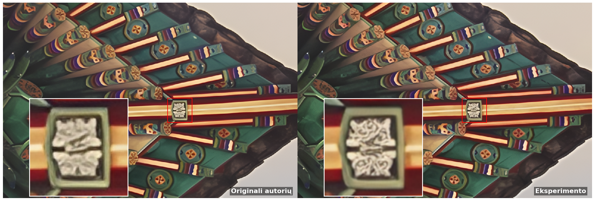
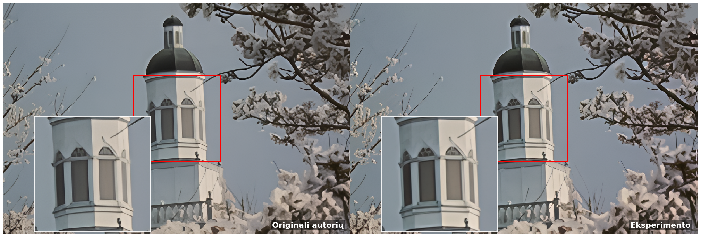
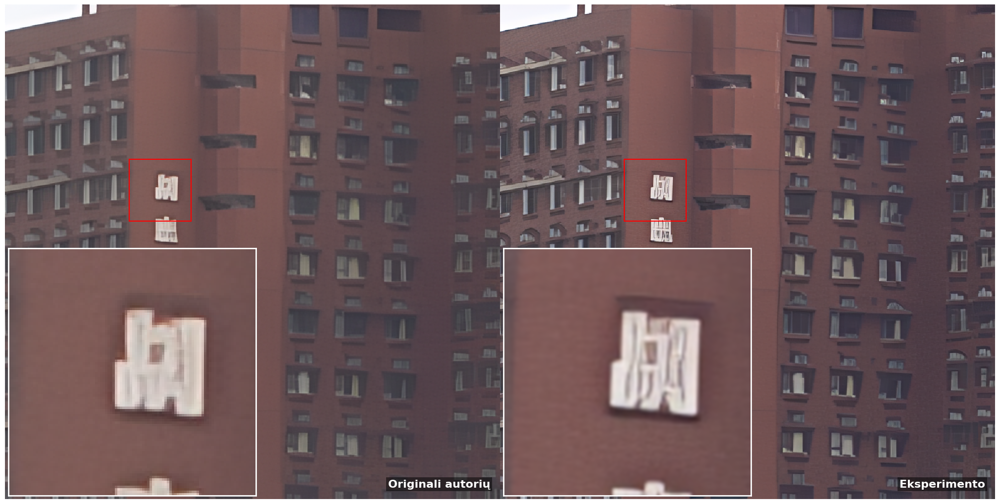

# Suvokiamos kokybės optimizavimas vieno vaizdo raiškos didinimo uždaviniuose

[](https://mgrybe.github.io/vdu-baigiamasis/)
[](https://opensource.org/licenses/MIT)
[](https://github.com/xpixelgroup/basicsr)
[](https://github.com/xpixelgroup/hat)
[](https://github.com/2minkyulee/AESOP-SR)

Šioje repozitorijoje pateikiamas magistro baigiamojo darbo **„Suvokiamos kokybės optimizavimas vieno vaizdo raiškos
didinimo uždaviniuose, integruojant HAT  architektūrą bei kombinuotas nuostolių funkcijas“** (autorius Marius Grybė,
Vytauto Didžiojo universitetas) programinis kodas ir tyrimų duomenys.

## Santrauka

> Šiame magistro darbe nagrinėjamas suvokiamos kokybės optimizavimas vieno vaizdo raiškos didinimo (SISR) uždaviniuose.
> Darbo tikslas - ištirti ir pritaikyti modernius giliųjų neuroninių tinklų apmokymo metodus, įgalinančius pasiekti
> aukštą
> vaizdo tikroviškumą. Atlikus literatūros analizę, bazine architektūra pasirinktas hibridinis dėmesio transformeris (
> HAT). Dėl savo gebėjimo efektyviai modeliuoti globalų vaizdo kontekstą ir į rekonstrukcijos procesą įtraukti didesnį
> pikselių kiekį, šis modelis demonstravo aukščiausią rekonstrukcijos tikslumą (vertinant pagal PSNR ir SSIM metrikas)
> bei
> subjektyvią vizualinę kokybę. Tyrimo metu buvo eksperimentuojama su įvairiais nuostolių funkcijų deriniais. Nustatyta,
> kad tradicinis pikselių lygmens nuostolis (L1) sukelia vaizdų susiliejimą, todėl jį naudinga pakeisti AESOP
> autoenkoderiu grįsta funkcija, atskiriančia struktūrinį tikslumą nuo natūralios tekstūrų variacijos. Eksperimentų
> rezultatai parodė, kad optimaliausią suvokimo ir iškraipymo kompromisą užtikrina AESOP turinio ir UNET
> priešpriešinio (
> GAN) nuostolių derinys. Pritaikius šį subalansuotą nuostolių funkcijų derinį HAT tinklui ir apmokius modelį su
> sudėtingomis realaus pasaulio vaizdų degradacijomis, pavyko reikšmingai pagerinti vizualinę kokybę: vaizdų ryškumas (
> pagal Laplaso dispersiją) padidėjo 35,57%, o natūralumas (pagal NIQE metriką) pagerėjo 4,34%, nesukuriant dirbtinių
> artefaktų. Vis dėlto tyrimas atskleidė esminį vertinimo metrikų apribojimą: nepaisant pasiektų vizualinių pagerinimų,
> suvokiamosios kokybės metrikos (LPIPS ir DISTS) šiuos pokyčius fiksavo silpnai. Tai rodo minėtų metrikų ribotumą
> vertinant subtilius fotorealistiškumo pokyčius.

## Rezultatai

Žemiau pateikiamas originalaus HAT metodo ir eksperimento metu patobulinto „RealHATGAN (sharper)“ modelio rezultatų palyginimas.





## Pagrindiniai eksperimentai

| Eksperimentas           | Nuoroda                                                                                                                                                                        |
|-------------------------|--------------------------------------------------------------------------------------------------------------------------------------------------------------------------------|
| 1. RealHATGAN           | [](https://colab.research.google.com/drive/1a-WJEwcxvwT7SMlxyIVb9Zduoc62bD5r?usp=sharing) |
| 2. RealHATGAN (sharper) | [](https://colab.research.google.com/drive/1IaO6IhEAneunY1RzbUW4dZG2gD6yaUCV?usp=sharing) |

## Apmokyti modeliai

### Naudoti modeliai

| Modelis                  | Atsisiųsti                                                                                                                                                                                               |
|--------------------------|----------------------------------------------------------------------------------------------------------------------------------------------------------------------------------------------------------|
| HATx4 (ImagNet pretrain) | [](https://drive.google.com/file/d/1SfwoCgMqmXMElCWbBUYf-nPkfzzZcsrG/view?usp=drive_link) |
| AESOPAutoEncoder         | [](https://drive.google.com/file/d/1eijc_brIDTgRJAUiN1QLbLEF3I40Wrn2/view?usp=drive_link) |
| AESOPRealAutoEncoder     | [](https://drive.google.com/file/d/1ZVwl0CRO8PVTJynF4WFDf9vws7fxupsp/view?usp=drive_link) |

### Originalūs modeliai

Čia pateikiami originalūs HAT metodo autorių publikuoti modeliai.

| Modelis              | Atsisiųsti                                                                                                                                                                                               |
|----------------------|----------------------------------------------------------------------------------------------------------------------------------------------------------------------------------------------------------|
| RealHATGAN           | [](https://drive.google.com/file/d/1uons4FS73XQL8t6T1VJ-wykPf4Yjl6rP/view?usp=drive_link) |
| RealHATGAN (sharper) | [](https://drive.google.com/file/d/1-vASh0nZbMS9mERQ7TrYRB8Vl_3Gn0DH/view?usp=drive_link) |

### Pagerinti modeliai

Čia pateikiami modeliai, gauti eksperimentuose 1 ir 2.

| Modelis              | Atsisiųsti                                                                                                                                                                                               |
|----------------------|----------------------------------------------------------------------------------------------------------------------------------------------------------------------------------------------------------|
| RealHATGAN           | [](https://drive.google.com/file/d/1XND7V-lGQVjsLoMr-MyyjqoaT4KBpiGA/view?usp=drive_link) |
| RealHATGAN (sharper) | [](https://drive.google.com/file/d/1_7cCJbA8ZvKf2spF8g2KYFSXIMqL4ywG/view?usp=drive_link) |

## Projekto struktūra

- `method/`: Pagrindinė modelių, architektūrų, nuostolių funkcijų ir metrikų realizacija.
    - `models/`: Aukšto lygio modelių logika (RealHATGAN, AESOP integracijos, MoE variantai).
    - `archs/`: Tinklų architektūros (HAT, DRCT, SwinIR).
    - `losses/`: Specifinės nuostolių funkcijos (AESOP, GAN nuostoliai).
- `options/`: YAML konfigūraciniai failai apmokymui ir testavimui.
- `notebooks/`: Jupyter užrašinės statistinei analizei ir vizualizacijai.
- `data/`: Eksperimentų rezultatai ir žurnalai (metrikos, apmokymo kreivės).
- `papers/`: Susiję moksliniai straipsniai ir jų metaduomenys.
- `demo/`: Projekto demonstracinio puslapio resursai.

## Aplinkos paruošimas

```bash
pyenv local 3.12.13 
python -m venv .venv
pip install -r requirements.txt
```

## Literatūra

[1] G. M. James, “Variance and Bias for General Loss Functions,” *Machine Learning*, vol. 51, pp. 115–135,

2003. [Online]. Available: [papers/L1-decomposition-A_1022899518027.pdf](papers/L1-decomposition-A_1022899518027.pdf)

[2] Z. Chen *et al*., “NTIRE 2025 Challenge on Image Super-Resolution (x4): Methods and Results,” *arXiv preprint arXiv:
2504.14582*, 2025. [Online]. Available: [papers/Ntire_2025_SR.pdf](papers/Ntire_2025_SR.pdf)

[3] J. Cai, H. Zeng, H. Yong, Z. Cao, and L. Zhang, “Toward Real-World Single Image Super-Resolution: A New Benchmark
and A New Model,” 2019. [Online]. Available: [papers/RealSR.pdf](papers/RealSR.pdf)

[4] M. Lee, S. Hyun, W. Jun, and J. Heo, “Auto-Encoded Supervision for Perceptual Image Super-Resolution,” *arXiv
preprint arXiv:2412.00124*, 2025. [Online]. Available: [papers/aesop-2412.00124v2.pdf](papers/aesop-2412.00124v2.pdf)

[5] M. Lee, S. Hyun, W. Jun, and J. Heo, “Auto-Encoded Supervision for Perceptual Image Super-Resolution,” in *Proc.
IEEE/CVF Conf. Comput. Vis. Pattern Recognit. (CVPR)*. [Online]. Available: [papers/aesop.pdf](papers/aesop.pdf)

[6] J. Park, S. Son, and K. M. Lee, “Content-Aware Local GAN for Photo-Realistic Super-Resolution,” in *Proc. IEEE/CVF
Int. Conf. Comput. Vis. (ICCV)*. [Online]. Available: [papers/calgan.pdf](papers/calgan.pdf)

[7] W. Lai, J. Huang, N. Ahuja, and M. Yang, “Deep Laplacian Pyramid Networks for Fast and Accurate Super-Resolution,”
*arXiv preprint arXiv:1704.03915*, 2017. [Online].
Available: [papers/charbonnier-loss-1704.03915v2.pdf](papers/charbonnier-loss-1704.03915v2.pdf)

[8] J. Wang, K. C. K. Chan, and C. C. Loy, “Exploring CLIP for Assessing the Look and Feel of Images,” *arXiv preprint
arXiv:2207.12396*, 2022. [Online]. Available: [papers/clipiqa-2207.12396v2.pdf](papers/clipiqa-2207.12396v2.pdf)

[9] E. J. Nunn, P. Khadivi, and S. Samavi, “Compound Fréchet Inception Distance for Quality Assessment of GAN Created
Images,” *arXiv preprint arXiv:2106.08575*, 2021. [Online].
Available: [papers/compound-fid-2106.08575v1.pdf](papers/compound-fid-2106.08575v1.pdf)

[10] L. Xie *et al*., “DeSRA: Detect and Delete the Artifacts of GAN-Based Real-World Super-Resolution Models,” in
*Proc. 40th Int. Conf. Mach. Learn. (ICML)*, 2023. [Online].
Available: [papers/desra-2307.02457v1.pdf](papers/desra-2307.02457v1.pdf)

[11] K. Ding, K. Ma, S. Wang, and E. P. Simoncelli, “Image Quality Assessment: Unifying Structure and Texture
Similarity,” *IEEE Trans. Pattern Anal. Mach. Intell.*, 2020. [Online].
Available: [papers/dists-2004.07728v3.pdf](papers/dists-2004.07728v3.pdf)

[12] C. Hsu, C. Lee, and Y. Chou, “DRCT: Saving Image Super-Resolution away from Information Bottleneck,” *arXiv
preprint arXiv:2404.00722*, 2024. [Online]. Available: [papers/drct-2404.00722v5.pdf](papers/drct-2404.00722v5.pdf)

[13] W. Shi *et al*., “Real-Time Single Image and Video Super-Resolution Using an Efficient Sub-Pixel Convolutional
Neural Network,” *arXiv preprint arXiv:1609.05158*, 2016. [Online].
Available: [papers/espcn-1609.05158v2.pdf](papers/espcn-1609.05158v2.pdf)

[14] A. Aitken *et al*., “Checkerboard Artifact Free Sub-Pixel Convolution: A Note on Sub-Pixel Convolution, Resize
Convolution and Convolution Resize,” *arXiv preprint arXiv:1707.02937*, 2017. [Online].
Available: [papers/espcn-checkboard-1707.02937v1.pdf](papers/espcn-checkboard-1707.02937v1.pdf)

[15] X. Wang *et al*., “ESRGAN: Enhanced Super-Resolution Generative Adversarial Networks,” *arXiv preprint arXiv:
1809.00219*, 2018. [Online]. Available: [papers/esrgan-1809.00219v2.pdf](papers/esrgan-1809.00219v2.pdf)

[16] M. Heusel, H. Ramsauer, T. Unterthiner, B. Nessler, and S. Hochreiter, “GANs Trained by a Two Time-Scale Update
Rule Converge to a Local Nash Equilibrium,” *arXiv preprint arXiv:1706.08500*, 2018. [Online].
Available: [papers/fid-1706.08500v6.pdf](papers/fid-1706.08500v6.pdf)

[17] I. J. Goodfellow *et al*., “Generative Adversarial Nets,” *arXiv preprint arXiv:1406.2661*, 2014. [Online].
Available: [papers/gan-1406.2661v1.pdf](papers/gan-1406.2661v1.pdf)

[18] X. Chen *et al*., “HAT: Hybrid Attention Transformer for Image Restoration,” *IEEE Trans. Pattern Anal. Mach.
Intell.*, 2025. [Online]. Available: [papers/hat-2309.05239v3.pdf](papers/hat-2309.05239v3.pdf)

[19] J. Liang, H. Zeng, and L. Zhang, “Details or Artifacts: A Locally Discriminative Learning Approach to Realistic
Image Super-Resolution,” *arXiv preprint arXiv:2203.09195*, 2022. [Online].
Available: [papers/ldl-2203.09195v1.pdf](papers/ldl-2203.09195v1.pdf)

[20] R. Zhang, P. Isola, A. A. Efros, E. Shechtman, and O. Wang, “The Unreasonable Effectiveness of Deep Features as a
Perceptual Metric,” *arXiv preprint arXiv:1801.03924*, 2018. [Online].
Available: [papers/lpips-1801.03924v2.pdf](papers/lpips-1801.03924v2.pdf)

[21] S. Yang *et al*., “MANIQA: Multi-Dimension Attention Network for No-Reference Image Quality Assessment,” *arXiv
preprint arXiv:2204.08958*, 2022. [Online]. Available: [papers/maniqa-2204.08958v2.pdf](papers/maniqa-2204.08958v2.pdf)

[22] J. Ke, Q. Wang, Y. Wang, P. Milanfar, and F. Yang, “MUSIQ: Multi-Scale Image Quality Transformer,” *arXiv preprint
arXiv:2108.05997*, 2021. [Online]. Available: [papers/musiq-2108.05997v1.pdf](papers/musiq-2108.05997v1.pdf)

[23] A. Mittal, R. Soundararajan, and A. C. Bovik, “Making a ‘Completely Blind’ Image Quality Analyzer,” *IEEE Signal
Process. Lett.*, 2013. [Online]. Available: [papers/niqe.pdf](papers/niqe.pdf)

[24] M. Lee and J. Heo, “Noise-Free Optimization in Early Training Steps for Image Super-Resolution,” *arXiv preprint
arXiv:2312.17526*, 2023. [Online]. Available: [papers/noise-free-2312.17526v1.pdf](papers/noise-free-2312.17526v1.pdf)

[25] Y. Blau and T. Michaeli, “The Perception-Distortion Tradeoff,” *arXiv preprint arXiv:1711.06077*, 2017. [Online].
Available: [papers/pdt-1711.06077v4.pdf](papers/pdt-1711.06077v4.pdf)

[26] J. Johnson, A. Alahi, and L. Fei-Fei, “Perceptual Losses for Real-Time Style Transfer and Super-Resolution,” *arXiv
preprint arXiv:1603.08155*, 2016. [Online].
Available: [papers/perceptual-loss-1603.08155v1.pdf](papers/perceptual-loss-1603.08155v1.pdf)

[27] Y. Zhang *et al*., “Image Super-Resolution Using Very Deep Residual Channel Attention Networks,” *arXiv preprint
arXiv:1807.02758*, 2018. [Online]. Available: [papers/rcan-1807.02758v2.pdf](papers/rcan-1807.02758v2.pdf)

[28] L. Xie, X. Wang, C. Dong, and Y. Shan, “Real-ESRGAN: Training Real-World Blind Super-Resolution with Pure Synthetic
Data,” *arXiv preprint arXiv:2107.10833*, 2021. [Online].
Available: [papers/real-esrgan-2107.10833v2.pdf](papers/real-esrgan-2107.10833v2.pdf)

[29] J. Cai, H. Zeng, H. Yong, Z. Cao, and L. Zhang, “Toward Real-World Single Image Super-Resolution: A New Benchmark
and A New Model,” *arXiv preprint arXiv:1904.00523*, 2019. [Online].
Available: [papers/realsr-1904.00523v1.pdf](papers/realsr-1904.00523v1.pdf)

[30] K. He, X. Zhang, S. Ren, and J. Sun, “Deep Residual Learning for Image Recognition,” *arXiv preprint arXiv:
1512.03385*, 2015. [Online]. Available: [papers/resnet-1512.03385v1.pdf](papers/resnet-1512.03385v1.pdf)

[31] J. Yang, J. Wright, Y. Ma, and T. Huang, “Image Super-Resolution as Sparse Representation of Raw Image Patches,” in
*Proc. IEEE Conf. Comput. Vis. Pattern Recognit. (CVPR)*, 2008. [Online].
Available: [papers/sparse-coding-v1.pdf](papers/sparse-coding-v1.pdf)

[32] J. Yang, J. Wright, T. Huang, and Y. Ma, “Image Super-Resolution via Sparse Representation,” *IEEE Trans. Image
Process.*, 2010. [Online]. Available: [papers/sparse-coding-v2.pdf](papers/sparse-coding-v2.pdf)

[33] T. Miyato, T. Kataoka, M. Koyama, and Y. Yoshida, “Spectral Normalization for Generative Adversarial Networks,” in
*Proc. Int. Conf. Learn. Represent. (ICLR)*, 2018. [Online].
Available: [papers/spectral-norm-gan-1802.05957v1.pdf](papers/spectral-norm-gan-1802.05957v1.pdf)

[34] C. Dong, C. C. Loy, K. He, and X. Tang, “Image Super-Resolution Using Deep Convolutional Networks,” *arXiv preprint
arXiv:1501.00092*, 2015. [Online]. Available: [papers/srcnn-1501.00092v3.pdf](papers/srcnn-1501.00092v3.pdf)

[35] C. Ledig *et al*., “Photo-Realistic Single Image Super-Resolution Using a Generative Adversarial Network,” *arXiv
preprint arXiv:1609.04802*, 2017. [Online]. Available: [papers/srgan-1609.04802v5.pdf](papers/srgan-1609.04802v5.pdf)

[36] J. Nilsson and T. Akenine-Möller, “Understanding SSIM,” *arXiv preprint arXiv:2006.13846*, 2020. [Online].
Available: [papers/ssim-2006.13846v2.pdf](papers/ssim-2006.13846v2.pdf)

[37] Z. Liu *et al*., “Swin Transformer: Hierarchical Vision Transformer Using Shifted Windows,” *arXiv preprint arXiv:
2103.14030*, 2021. [Online]. Available: [papers/swin-2103.14030v2.pdf](papers/swin-2103.14030v2.pdf)

[38] J. Liang *et al*., “SwinIR: Image Restoration Using Swin Transformer,” *arXiv preprint arXiv:2108.10257*,

2021. [Online]. Available: [papers/swinir-2108.10257v1.pdf](papers/swinir-2108.10257v1.pdf)

[39] W. Fedus, B. Zoph, and N. Shazeer, “Switch Transformers: Scaling to Trillion Parameter Models with Simple and
Efficient Sparsity,” *J. Mach. Learn. Res.*, vol. 23, pp. 1–40, 2022. [Online].
Available: [papers/swith-transformer-2101.03961v3.pdf](papers/swith-transformer-2101.03961v3.pdf)

[40] C. Chen *et al*., “TOPIQ: A Top-Down Approach from Semantics to Distortions for Image Quality Assessment,” *arXiv
preprint arXiv:2308.03060*, 2023. [Online]. Available: [papers/topiq.pdf](papers/topiq.pdf)

[41] A. Vaswani *et al*., “Attention Is All You Need,” *arXiv preprint arXiv:1706.03762*, 2017. [Online].
Available: [papers/transformers-1706.03762v7.pdf](papers/transformers-1706.03762v7.pdf)

[42] A. Dosovitskiy *et al*., “An Image Is Worth 16x16 Words: Transformers for Image Recognition at Scale,” in *Proc.
Int. Conf. Learn. Represent. (ICLR)*, 2021. [Online].
Available: [papers/vit-2010.11929v2.pdf](papers/vit-2010.11929v2.pdf)